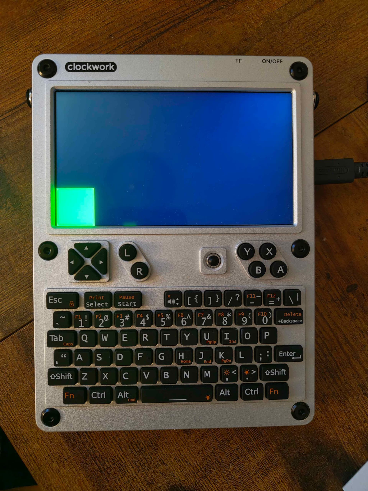
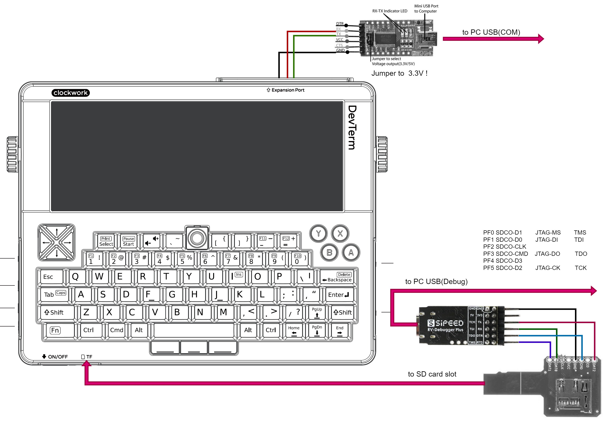
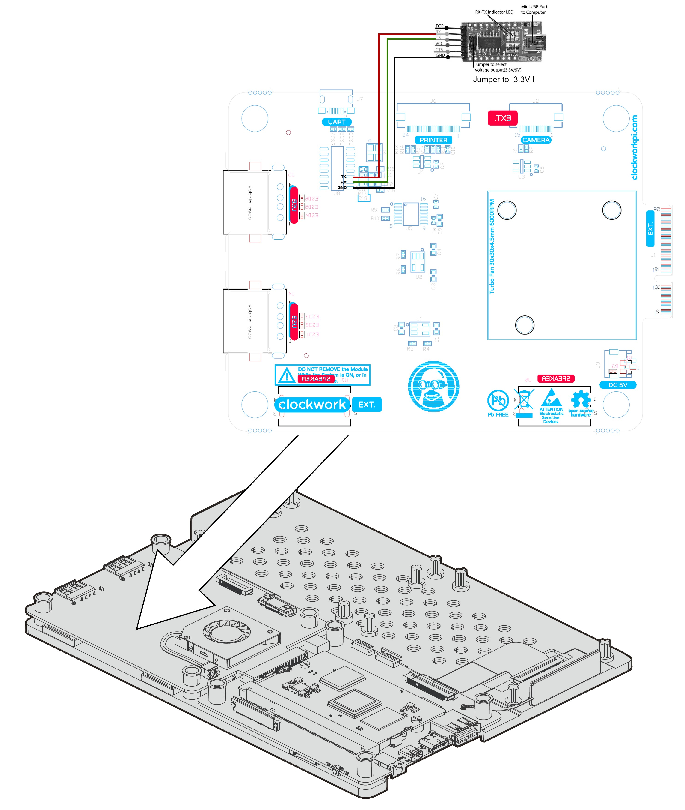

# Overview
This is an experimentation with the [RT-Thread Operating System](https://www.rt-thread.io/) with the [Allwinner D1H](https://d1.docs.aw-ol.com/en/) RISC-V SOC and a Collection of Bootloaders and Developer environment for programming and debugging.  

Executed at hardware such as [ClockworkPi uConsole R-01](https://www.clockworkpi.com/uconsole),[ClockworkPi DevTerm R-01](https://www.clockworkpi.com/home-devterm) and [Sipeed Lichee RV + Dock](https://wiki.sipeed.com/hardware/en/lichee/RV/Dock.html).

The intention is to easily run peripherals in D1, exactly Display. RT-Thread OS was chosen because it looks like has the most extensive HAL layer for D1, similar to the [Linux kernel](https://github.com/cuu/last_linux-5.4/tree/master/drivers/video/fbdev/sunxi/) but not so overcomplicated.

At the original repository [RT-Thread](https://github.com/RT-Thread/rt-thread) the compilation is not streamlined for D1H [^1].
So was performed fork from [v5.0.2](https://github.com/RT-Thread/rt-thread/releases/tag/v5.0.2) and introduced several changes to make it runnable in D1H. Added also bootloaders, compiler, debugger, build system.

Introduced code changes, knowledge and experience described in [series of articles](documentation/D1_0_index.md) stored in repository.<br>
Discussion in: https://forum.clockworkpi.com/t/r-01-risc-v-baremetal-with-rt-thread-lcd-work-usb-in-progress/14683

 > [^1]: At time when I'm tried to compile was [issue 9063](https://github.com/RT-Thread/rt-thread/issues/9063) after it was solved by [PR](https://github.com/RT-Thread/rt-thread/pull/9142) in Master.

## Current progress

1. RT-Thread could run in ClockworkPi DevTerm R-01 and manage MIPI DSI LCD Display  


2. RT-Thread could run in ClockworkPi uConsole R-01 and manage MIPI DSI LCD Display (experimental parameters, use with caution).



3. Also could run in Sipeed Lichee RV and manage RGB LCD Display [lichee_lcd_rgb_work](documentation/Pics/lichee_lcd_rgb_work.jpg)

# Installation
In repository exist pre-builded images for SD card in folder [image](image), need to flash it to SD card and install to device.
- For ClockworkPi DevTerm R01 board please use [image/sd_image_devterm.img](image/sd_image_devterm.img)
- For ClockworkPi uConsole R01 board please use [image/sd_image_uconsole.img](image/sd_image_uconsole.img) (experimental parameters, use with caution)
- For Sipeed Lichee RV board please use [image/sd_image_lichee.img](image/sd_image_lichee.img)

## Windows
Could use https://etcher.balena.io/#download-etcher for flash image to SD card.

## Linux
Could use command 
```sh
make sd_burn
```
Or
```sh
sudo dd if=image/sd_image_lichee.img of=/dev/sdb
```
*where /dev/sdb - your SD card device

# Run
Configure UART adapter to 115200 baud rate, 8N1. And connect to UART pins as shown in [Hardware section](#hardware).    

Insert flashed SD card to device and power on, should see at the end of output like this:
```
 \ | /
- RT -     Thread Smart Operating System
 / | \     5.0.2 build Jun  9 2024 21:11:05
 2006 - 2022 Copyright by RT-Thread team
hal_sdc_create 0
card_detect insert
Initial card success. capacity :15200MB
sdmmc bytes_per_secotr:200, sector count:1db0000
not found partition of mbr, construct sd0 at offset 8M, size:0xffffffffb5800000
[D/FAL] (fal_flash_init:47) Flash device |                  sdcard0 | addr: 0x00000000 | len: 0xb6000000 | blk_size: 0x00000200 |initialized finish.
[I/FAL] ==================== FAL partition table ====================
[I/FAL] | name       | flash_dev |   offset   |    length  |
[I/FAL] -------------------------------------------------------------
[I/FAL] | download   | sdcard0   | 0x00800000 | 0x00800000 |
[I/FAL] | easyflash  | sdcard0   | 0x01000000 | 0x00100000 |
[I/FAL] | filesystem | sdcard0   | 0x01100000 | 0x00c00000 |
[I/FAL] =============================================================
[I/FAL] RT-Thread Flash Abstraction Layer initialize success.
Hello RISC-V
msh />Mount "sd0p0" on "/" fail
```
## Repo structure
```sh
$tree -L 2

RT-Thread-on-Allwinner-D1H
    ├── bootloaders
    │   ├── opensbi
    │   ├── sun20i_d1_spl
    │   ├── u-boot         # U-boot repo. Folder originally not exist, will be created after make will executed
    │   └── xfel
    │   ├── opensbi_config
    ├── build
    │   ├── sd.bin
    │   ├── sun20i-d1-lichee-rv-dock.dtb
    │   ├── toc1_D1H.cfg
    │   └── .gdbinit
    ├── debugger            # Folder will be created by make
    │   ├── bl702_cklink_whole_img_v2.2.bin
    │   ├── blisp
    ├── documentation
    │   ├── Allwinner_D1H
    │   ├── ClockworkPi_DevTerm
    │   ├── Pics
    │   ├── RISC-V    
    │   ├── Sipeed_Lichee_RV
    │   ├── uConsole
    │   └── USB
    ├── image
    │   ├── sd_image_devterm.img
    │   ├── sd_image_uconsole.img
    │   └── sd_image_lichee.img
    ├── rt-thread
    │   ├── bsp/allwinner/d1s_d1h/
    │   ...
    ├── toolchain           # Folder will be created by make
    │   └── riscv64-linux-musleabi_for_x86_64-pc-linux-gnu
    │   └── riscv64-glibc-gcc-thead_20200702     
    │   └── T-HEAD_DebugServer
    ├── Makefile
    ├── environment.sh
    ├── LICENSE
    └── README.md
```
## Environment
Tested on Ubuntu 22.04.3 64x. On machine need to be installed make environment:
```sh
sudo apt install git make build-essential scons libusb-1.0-0-dev libncurses5-dev
```
If needed to specify installation folders for toolchain and u-boot please modify environment.sh script to specify this variables 
- TOOLCHAIN_INSTALL_DIR - path for installation dir for toolchain ex.: $HOME/toolchain
- U_BOOT_INSTALL_DIR - path for installation dir for u-boot bootloader ex.: $HOME/u-boot   

Then execute due each session:
```sh
 source ./environment.sh
```
Or add to ~/.bashrc

### Environment setup with virtual machine
In my case I was use Windows 10 64x as a host with IDE VSCode and Ubuntu 22.04.3 64x virtual machine as a guest for compilation.   
Repo was downloaded to a shared folder in Windows mounted in Ubuntu, /etc/fstab example
```sh
.host:/ /mnt/hgfs       fuse.vmhgfs-fuse    defaults,allow_other    0    0
```
Notice: in a virtual machine with a mounted shared folder, it isn't possible to create hard links.   
So as toolchain and u-boot use hard links it is impossible to extract toolchain and u-boot files to this mounted folder. Need to use internal filesystem in a virtual machine.   
For this was provided installation folders in environment.sh script described above.

## Build toolchain
Installing toolchain
```sh
make toolchain

* T-HEAD_DebugServer will request specify installation dir: 'Set full installing path:'
  Could be seted as $HOME/toolchain or RT-Thread-on-Allwinner-D1H/toolchain folder
```
Will be installed:
- riscv64-linux-musleabi_for_x86_64-pc-linux-gnu (Used by RT-Thread compilation)
- riscv64-glibc-gcc-thead_20200702 (Need for using GDB)
- T-HEAD_DebugServer (Need for using JTAG connection)

## Build bootloaders
To compile bootloaders use command
```sh
make bootloaders
```
Will be compiled:
- sun20i_d1_spl (first bootloader after BROM, used for init DRAM and load TOC image from MMC)
- u-boot (could used to load Linux image but now just tool to create TOC image)
- opensbi (Supervisor Binary Interface for platform in M mode)
- xfel (used for debug when platform in FEL mode)

## Build RT-Thread
For configure RT-Thread:
```sh
make rt-conf
```
In menuconfig chooses: 
- "General Drivers Configuration" -> "Choose Board" and then choose "ClockworkPi DevTerm R01 board" or "ClockworkPi uConsole R01 board" or "Sipeed Lichee RV board" depend what board do you use.

Also need to choose only one LCD panel and only one Board:
- "HAL library from sunxi" -> "Video support for sunxi" -> "LCD panels select" -> "LCD support ICN9707_480x1280 panel" for Devterm OR "LCD support CWU50 panel" for uConsole
- "HAL library from sunxi" -> "Video support for sunxi" -> "Soc and board select" -> "Board Select" -> "Clockworkpi Devterm R01 board with MIPI DSI display ICN9707" for Devterm respectively

To compile RT-Thread use command:
```sh
make rt
```
For clean:
```sh
make rt-clean
```
## Build SD card image
To create SD card image in [image](image) folder:
```sh
make sd
```
For flash to SD card:
```sh
make sd_burn
```

## Debugging
For debugging used Sipeed RV-Debugger Plus with [T-Head CKLink firmware](https://github.com/bouffalolab/bouffalo_sdk/tree/master/tools/cklink_firmware).   
To connect debugger to board need use MicroSD breakout board because in D1H JTAG pins mapped to SD Card [pins](https://linux-sunxi.org/JTAG) as shown in [Hardware section](#hardware).  

For flash firmware to Sipeed RV-Debugger Plus - Press and hold the boot pin then plug the usb in the computer to go to the boot mode. And execute command:
```sh
make debug-burn
```
To start GDB session in device that have FEL button (Sipeed Lichee RV) - press and hold the FEL button then press RESET button to go to the FEL mode, then execute command OR for device without FEL button (Clockwork Devterm) just don't insert boot SD card, press POWER button and execute command:
```sh
make debug
```
Should see at the output the like this:
```
+---                                                    ---+
|  T-Head Debugger Server (Build: Oct 21 2022)             |
   User   Layer Version : 5.16.05
   Target Layer version : 2.0
|  Copyright (C) 2022 T-HEAD Semiconductor Co.,Ltd.        |
+---                                                    ---+

...

GDB connection command for CPUs(CPU0):
        target remote 127.0.0.1:1025

...

0x000000000000a22a in ?? ()
Restoring binary file bootloaders/opensbi/build/platform/generic/firmware/fw_dynamic.bin into memory (0x40000000 to 0x40042790)
Restoring binary file build/sun20i-d1-lichee-rv-dock.dtb into memory (0x40200000 to 0x40207b23)
Restoring binary file rt-thread/bsp/allwinner/d1s_d1h/rtthread.bin into memory (0x40400000 to 0x404f0840)
```

## Hardware
- [ClockworkPi DevTerm R01](https://www.clockworkpi.com/home-devterm)
- [Sipeed Lichee RV + Dock](https://wiki.sipeed.com/hardware/en/lichee/RV/Dock.html)
- Lichee RV Dock extension LCD adapter board
- 4.3 RGB LCD Display (043026-N6(ML)) with IC ST7001s (SPI)
- FTDI 2248-c USB/UART adapter
- Sipeed RV-Debugger Plus
- MicroSD_Sniffer

### ClockworkPi DevTerm R01 assembly


I figure out that integrated UART work very unstable. According [discussion](https://forum.clockworkpi.com/t/devterm-r-01-ext-board-uart-is-read-only/8704)
"The problem is that the CH340C provides 5 V logic levels, whereas the D1 only supports 3.3 V I/O...A better solution would be to solder wires to pins 2 and 3 of the CH340C and use a different USB-UART adapter that runs at the correct voltage." So I do this:


### Sipeed Lichee RV assembly


## Links
- https://linux-sunxi.org/Allwinner_Nezha  
- https://andreas.welcomes-you.com/boot-sw-debian-risc-v-lichee-rv
- https://github.com/clockworkpi/DevTerm/tree/main/Code/patch/d1
- https://github.com/smaeul/linux/tree/d1/all

## TODO
- Keyboard, trackball
- Build RTT gui


