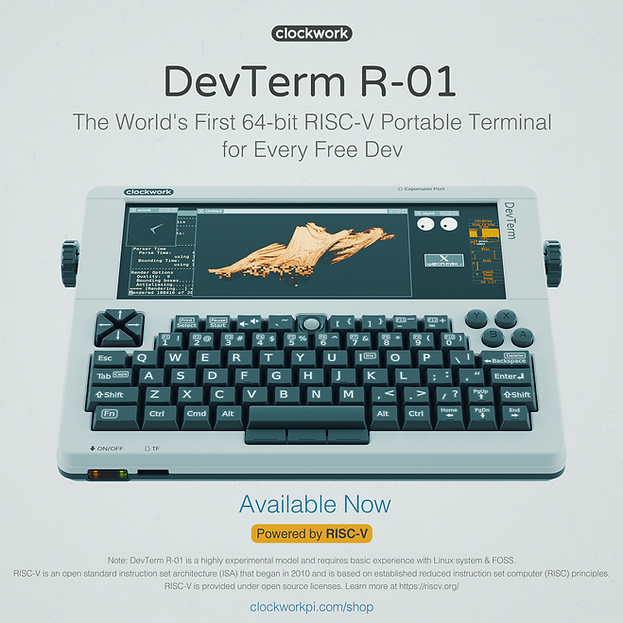

# D1-1. Introduction
[Index](D1_0_index.md) | [Next chapter](D1_2_boot_process.md)

By this introduction I beginning a series of articles about hobby experimentation with [Allwinner D1H](https://d1.docs.aw-ol.com/en/) RISC-V MCU and the [RT-Thread](https://www.rt-thread.io/) Operating System. 
Code represented in: https://github.com/ylyamin/RT-Thread-on-Allwinner-D1H  

Next chapters will describe:

[D1-2. Boot process](D1_2_boot_process.md) - Existing Allwinner D1H bootloaders best practice in example with booting Linux and RT-Thread, also looks to JTAG and GDB debugging.

[D1-3. RT-Thread overview and Build](D1_3_rtt_overview_and_build.md) - Overview of RT-Thread structure and libraries. Compile RT-Thread for Allwinner D1H platform.

[D1-4. Makefile and Hardware changes](D1_4_make_and_hw.md) - My repository structure, Makefile and Hardware changes was needed to be done.

[D1-5. LCD Display driver](D1_5_lcd_driver.md) - Display driver for [ClockworkPi DevTerm](https://www.clockworkpi.com/home-devterm), [uConsole R01](https://www.clockworkpi.com/uconsole) and [Sipeed Lichee RV](https://wiki.sipeed.com/hardware/en/lichee/RV/Dock.html)

[D1-6. USB Keyboard](D1_6_usb_keyboard.md) - USB Keyboard driver for ClockworkPi DevTerm, still not work.

Long story short: initially my dream was to understand how Operating System work at a low level mean scheduler, memory management, drivers. And with Allwinner D1H my dream has come true ... sort of. Now my hobby is reverse engineering Allwinner stuff.
  
I'm not professional programmer thinking studying OS by diving to Linux Kernel will be too complex and I need to start from ground. Interested in the RISC-V architecture. Play with RISC-V virtualizer is good but not so fun, I want real hardware but without lots of wires, oscilloscope and soldering, just ready stuff with user input and output to display (at some point I bought a solder). Found [ClockworkPi DevTerm](https://www.clockworkpi.com/home-devterm) Open Source Portable retro-entertainment Terminal with support for various core ARM and RISC-V. 

And additional module RISC-V R-01 core with 64-bit RISC-V MCU and 1GB DDR3 memory. 
Inside Allwinner D1H SoC - and is where I found pain. 
I thought if Linux can run on this chip then definitely I can implement some baremetal drivers. But in reality Allwinner documentation very limited about pirepherals, no examples, no standalone library. Allwinner Drivers in Linux is a thousand lines of code mixed with all Allwinner platforms and Linux libraries. Why is this so ? Who knows. Maybe pirepherals in SoC is Intellectual Property from external suppliers and can be provided only if you have commercial agreement. 
Any way, we have enthusiasts that try to do something https://linux-sunxi.org/Allwinner_Nezha, https://github.com/hno/Allwinner-Info.

One moment I found that in RT-Thread OS, is embedded small OS, they have HAL layer for D1. And is HAL separated from OS and is located in one place. Close looking understand that this HAL quite similar with Linux drivers. Also [Melis OS](https://github.com/Tina-Linux/d1s-melis/) looks like RTOS from Allwinner and is have similar HAL.

So this series of articles about my knowledge and experience I got from Allwinner D1H and RT-Thread. 

[Index](D1_0_index.md) | [Next chapter](D1_2_boot_process.md)

TODO:
- try [PR](https://github.com/RT-Thread/rt-thread/pull/9142) for d1s in d1h
- create RTT mirror and new PR for d1h common folder
- create new PR for display drivers
- Battery not garanted

